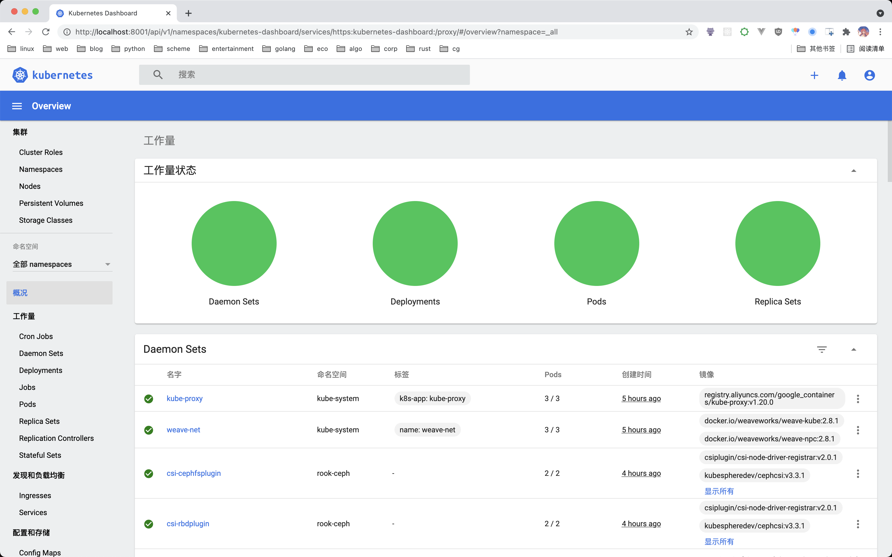

## Dashboard
**Step1. Install Dashboard**
```sh
kubectl apply -f https://raw.githubusercontent.com/kubernetes/dashboard/v2.0.0/aio/deploy/recommended.yaml
```
**Step2. Generate Token**
```sh
kubectl apply -f admin-user.yaml
kubectl -n kubernetes-dashboard describe secret $(kubectl -n kubernetes-dashboard get secret | grep admin-user | awk '{print $1}')
# Name:         admin-user-token-w5cjb
# Namespace:    kubernetes-dashboard
# Labels:       <none>
# Annotations:  kubernetes.io/service-account.name: admin-user
#               kubernetes.io/service-account.uid: 9b994657-6769-45fc-8937-e054e0a64d23
# 
# Type:  kubernetes.io/service-account-token
# 
# Data
# ====
# token:      eyJhbGciOiJSUzI1NiIsImtpZC...........OQ9w_Xijn01HA
# ca.crt:     1066 bytes
# namespace:  20 bytes
```
Copy and save given token.

**Step3. Proxy on Master**
```sh
kubectl proxy --address='0.0.0.0' --disable-filter=true
```
**Step4. SSH Proxy on Guest**
```sh
ssh -L localhost:8001:localhost:8001 -NT {username}@{k8smaster} # replace username@k8smaster with the username on master node ip
```
**Step5. Visit Dashboard**

Visit http://localhost:8001/api/v1/namespaces/kubernetes-dashboard/services/https:kubernetes-dashboard:/proxy/ on the guest browser and paste the token to login.


